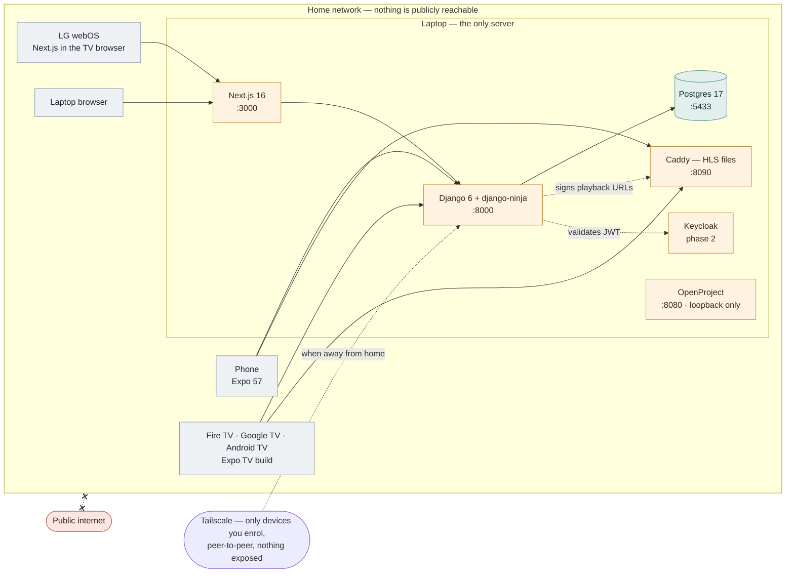
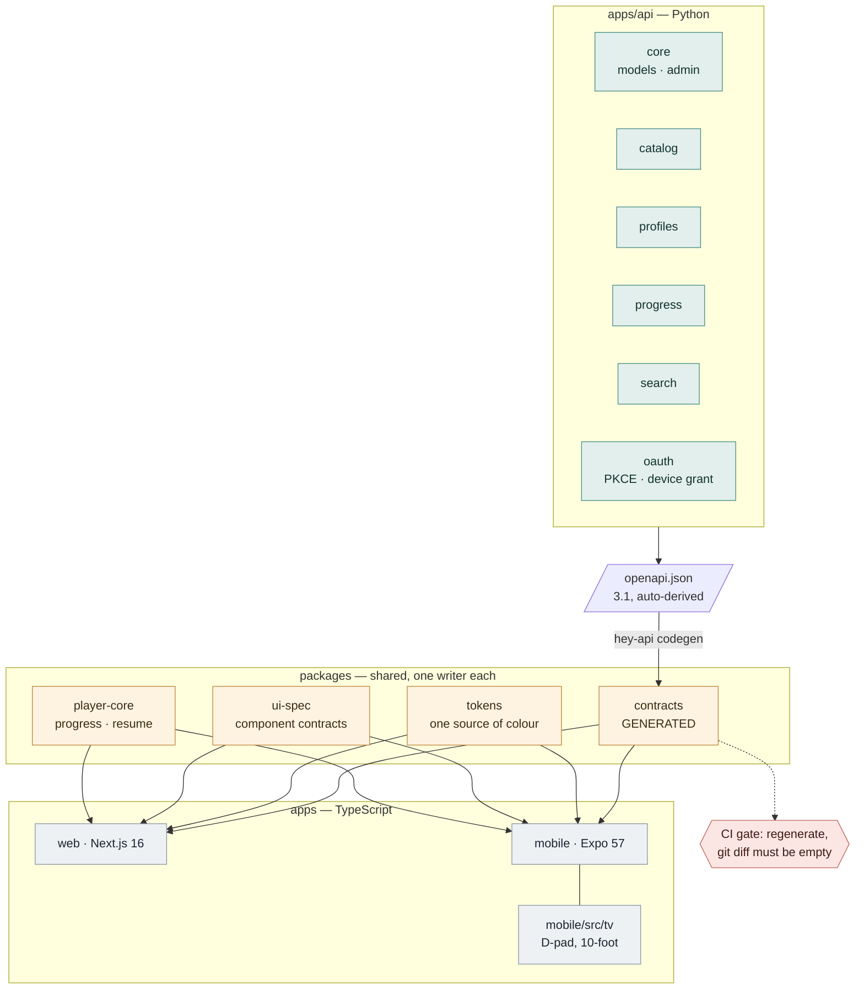
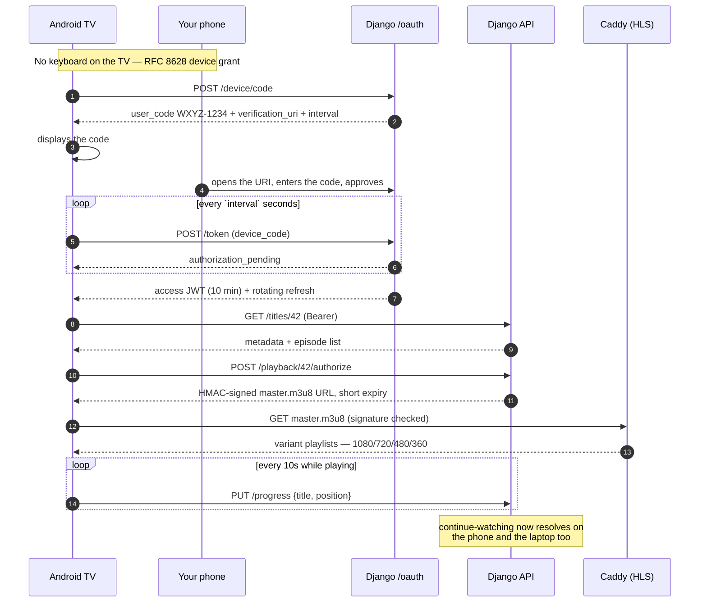
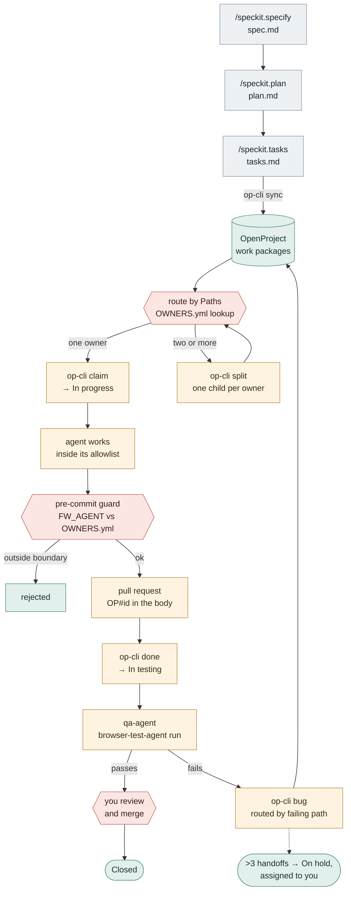
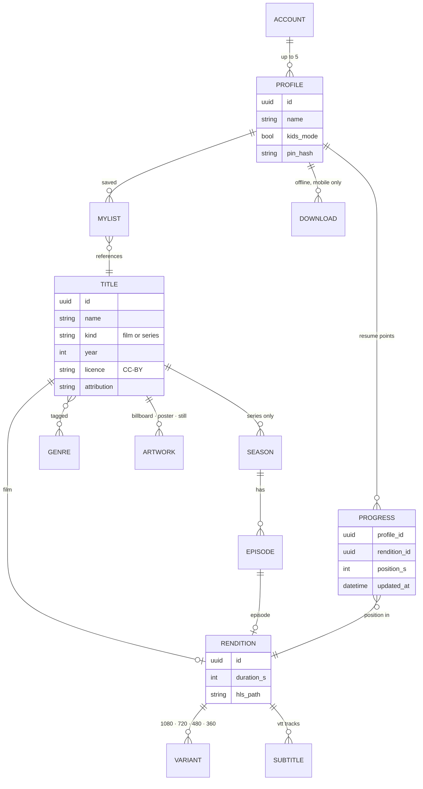

# Fun World — Architecture

A private home streaming app. One laptop is the server; phones, laptops and
four televisions are the clients. Nothing is reachable from the public
internet, and nothing costs money to run.

Five views, from the house down to the database. Diagrams render on GitHub and
in VS Code's Markdown preview. The full designed plan — decisions, tradeoffs,
constraints and build order — is [`docs/build-plan.html`](build-plan.html);
open it in a browser.

| | |
|---|---|
| **API** | Django 6.0 + django-ninja, Python 3.13, uv |
| **Web** | Next.js 16 (also the LG webOS client) |
| **Phone + TV** | Expo SDK 57 — one build covers Fire TV, Google TV, Android TV |
| **Database** | PostgreSQL 17 (Docker, `:5433`) |
| **Video** | ffmpeg → HLS on disk, served by Caddy (`:8090`) |
| **Auth** | Own OAuth 2.1 (PKCE + RFC 8628 device grant), later Keycloak |
| **Contracts** | Generated from OpenAPI 3.1 by `@hey-api/openapi-ts` |
| **Board** | Self-hosted OpenProject 17 (`:8080`, loopback only) |

The rules everything obeys: [`.specify/memory/constitution.md`](../.specify/memory/constitution.md)
and [`OWNERS.yml`](../OWNERS.yml).

---

## 1. Where things run

Three of the four televisions are Android-based, so a single Expo build covers
Fire TV, Google TV and Android TV; LG webOS runs the Next.js app in its browser
instead. OpenProject binds to loopback only — the televisions never need the
ticket system. The crossed edge is the point: no path from the public internet
reaches anything here.

## 2. How the code fits together

The seam between Python and TypeScript is **generated, not written**. Because
the API is Python and both clients are TypeScript, shared types come out of the
OpenAPI document rather than being hand-maintained — and the CI gate turns
drift into a build failure rather than a code-review comment.

## 3. Watching something on the television

The television never handles a credential. It holds a device code, then tokens.
The secret is typed on a device that has a keyboard — which is why every real
streaming service works this way (RFC 8628), and why implementing it is the
most directly useful auth exercise in this project.

Note the polling interval is **server-dictated**. Ignoring it earns `slow_down`;
the correct response is to back off, not to tighten the loop.

## 4. How work reaches an agent

**No agent ever picks a recipient.** The only way work reaches a second agent is
a path lookup in `OWNERS.yml`, which is a pure function — the same paths always
resolve to the same owner, so a hand-off loop has nowhere to form. The one case
that *can* cycle (fix → retest → still red) is caught by the handoff counter,
which escalates to a human at 3.

An agent that cannot finish a ticket does not pass it on. It **splits** it, and
each child routes independently.

## 5. The content model

Progress is keyed on the **rendition**, not the title — so an episode resumes
where you left that episode, rather than where you left the series. `licence`
and `attribution` are columns rather than documentation, because CC-BY requires
the credit to actually be shown to the viewer.

---

## Constraints worth knowing before you touch anything

**Your phone cannot reach `localhost`.** The Expo app on a physical device is a
different machine. Bind services to `0.0.0.0`, put the LAN IP (or the Tailscale
MagicDNS name) in env, and open the Windows Firewall ports. The HLS base URL
needs the same treatment, or video plays on the laptop and fails on the TV.

**RSC and a separate API need a deliberate token handoff.** Next.js server
components cannot see a browser-held token. Get this wrong and pages render on
client navigation but 401 on hard refresh. The httpOnly cookie in the auth
design is what solves it.

**Television is a third interaction model, not a re-skin.** D-pad focus, 10-foot
type, overscan-safe margins, no hover. The "same UI, colours change" guarantee
stops at the TV — deliberately.

**NativeWind v5 is a preview track.** It is what gives Tailwind v4 syntax on
native. The token package can emit both formats, so reversing this is a config
change rather than a rewrite.
